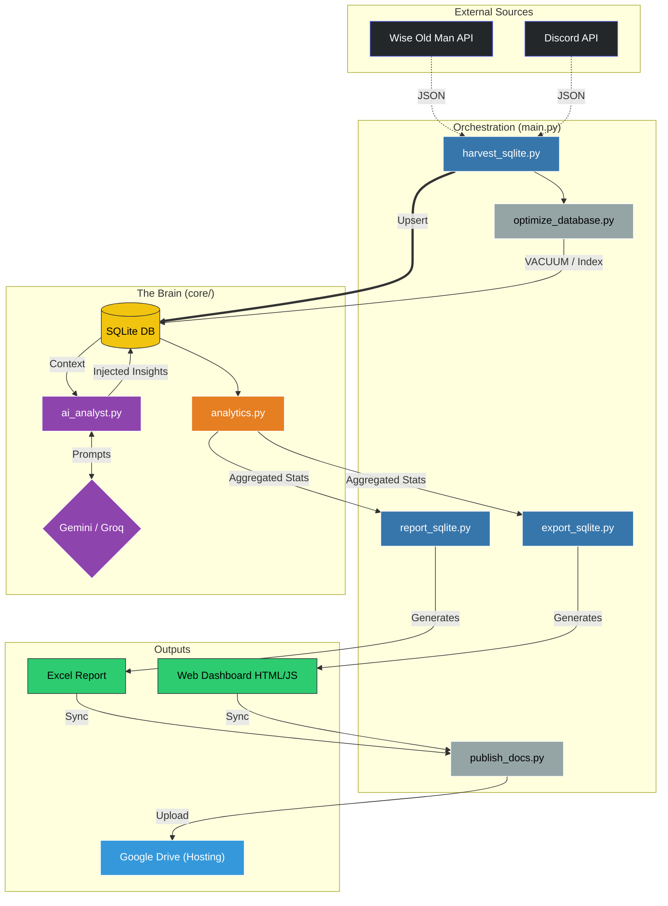

# ⚔️ ClanStats: The "Enterpise-Grade" OSRS Tracker

> **"Where Data Science Meets Shitposting."**


**ClanStats** isn't just another XP tracker. It's a **psychological warfare tool** disguised as analytics. By correlating **Wise Old Man (WOM)** game data with **Discord** social activity, we answer the real questions:

* *"Who chats the most but grinds the least?"*
* *"Who is effectively a ghost?"*
* *"Who deserves a promotion based on 'Vibes'?"*

---

## 🚀 The Goods

### 📊 The Dashboard (Neon Mode)

A deployed, static HTML/JS dashboard that feels like a futuristic command center.

* **Activity Heatmaps**: See exactly *when* your clan wakes up.
* **Boss Highlight Grid**: 3x3 grid of top killers backed by official OSRS art.
* **"The Matrix"**: A scatter plot comparing **XP Gains** vs **Message Volume**. Find your "Chatterboxes" (High Msg, Low XP) and "Grinders" (Low Msg, High XP).

### 🤖 The AI Analyst

We don't just show numbers; we judge them.

* **Roast Logic**: The AI detects "Unhealthy Obsessions" (e.g., higher KC than distinct messages) and tells members to "Touch Grass".
* **Leadership Banter**: Customized prompts ensure the AI knows who the boss is (and who to roast).
* **Context Aware**: Knows the difference between a "Slacker" (0 XP/0 Msgs) and a "Vacationer".

### 📑 The "Boss-Level" Excel Report

For the officers who love spreadsheets.

* **Conditional Formatting**: Red/Yellow/Green scales for easy spotting of underperformers.
* **Retention Risk**: Auto-flags members who are drifting away.
* **Merged Stats**: 7-Day, 30-Day, and All-Time stats in a single view.

---

## ⚡ Quick Start

You don't need a PhD in Computer Science to run this (but it helps).

### 1. Setup

Runs the "One-Click" installer to set up Python and dependencies.

```powershell
./setup.bat
```

### 2. Configure

Edit the generated `.env` file with your keys:

```ini
WOM_API_KEY=your_key_here
WOM_GROUP_ID=11114  <-- Your Clan ID
DISCORD_TOKEN=your_bot_token
LOCAL_DRIVE_PATH="G:/My Drive/Shared_clan_data" <-- Where to deploy the dashboard
```

### 3. Run

Smash that big red button (virtually):

```powershell
./run_auto.bat
```

*This fetches data, crunches numbers, consults the AI, generates the report, and deploys the dashboard.*

---

## 🛠️ Tech Stack

* **Core**: Python 3.10+ (AsyncIO for speed)
* **Database**: SQLite (Local, fast, no server fees)
* **Data Sources**:
  * **Wise Old Man API** (OSRS Stats)
  * **Discord API** (Social Stats)
* **Frontend**: HTML5 / Chart.js / G2Plot (Static generation)
* **AI**: Gemini Flash / Groq (The brains of the operation)

---

## 🏗️ Data Pipeline



---

## 📜 The "Golden Rule"

> **"Messages > XP"**

In this clan, we value **yappers**. Someone who talks all day but gets 0 XP is a **Social Pillar**. Someone who gets 200M XP but never talks is a **Ghost**. The analytics engine is weighted to reflect this profound truth.

---

### 📂 Directory Map

* `core/` - The brains (Config, Analytics, Math).
* `services/` - The hands (Discord, WOM, AI Clients).
* `scripts/` - The workers (Harvest, Report, Export).
* `assets/` - The bling (Images, CSS).
* `docs/` - The deployment zone (Live Dashboard).

---

*Built with ❤️ (and a little bit of spite) for the boys.*
